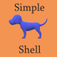

<div id="top"></div>
<!--
*** Thanks for checking out the Best-README-Template. If you have a suggestion
*** that would make this better, please fork the repo and create a pull request
*** or simply open an issue with the tag "enhancement".
*** Don't forget to give the project a star!
*** Thanks again! Now go create something AMAZING! :D
-->


<!-- PROJECT SHIELDS -->
<!--
*** I'm using markdown "reference style" links for readability.
*** Reference links are enclosed in brackets [ ] instead of parentheses ( ).
*** See the bottom of this document for the declaration of the reference variables
*** for contributors-url, forks-url, etc. This is an optional, concise syntax you may use.
*** https://www.markdownguide.org/basic-syntax/#reference-style-links
-->
[![Contributors][contributors-shield]][contributors-url]
[![Forks][forks-shield]][forks-url]
[![Stargazers][stars-shield]][stars-url]
[![Issues][issues-shield]][issues-url]
[![MIT License][license-shield]][license-url]


<!-- PROJECT LOGO -->
<br />
<div align="center">
  <a href="https://github.com/corbinenterline1/simple_shell">
    
  </a>

<h3 align="center">Simple Shell</h3>

  <p align="center">
    A simple shell recreation for learning purposes.
    <br />
    <a href="https://github.com/corbinenterline1/simple_shell"><strong>Explore the docs »</strong></a>
    <br />
    <br />
    <a href="https://github.com/corbinenterline1/simple_shell/issues">Report Bug</a>
    ·
    <a href="https://github.com/corbinenterline1/simple_shell/issues">Request Feature</a>
  </p>
</div>


<!-- TABLE OF CONTENTS -->
<details>
  <summary>Table of Contents</summary>
  <ol>
    <li>
      <a href="#about-the-project">About The Project</a>
      <ul>
        <li><a href="#built-with">Built With</a></li>
      </ul>
    </li>
    <li>
      <a href="#getting-started">Getting Started</a>
      <ul>
        <li><a href="#prerequisites">Prerequisites</a></li>
        <li><a href="#installation">Installation</a></li>
      </ul>
    </li>
    <li><a href="#usage">Usage</a></li>
    <li><a href="#roadmap">Roadmap</a></li>
    <li><a href="#contributing">Contributing</a></li>
    <li><a href="#license">License</a></li>
    <li><a href="#contact">Contact</a></li>
    <li><a href="#acknowledgments">Acknowledgments</a></li>
  </ol>
</details>


<!-- ABOUT THE PROJECT -->
## About The Project

[![Simple Shell Screenshot][product-screenshot]](https://example.com)

Simple Shell was created by Corbin Enterline & Jill Rogers for a project in the second trimester of the Foundations year at Holberton School.  

<p align="right">(<a href="#top">back to top</a>)</p>


<!-- GETTING STARTED -->
## Getting Started

This is an example of how you may give instructions on setting up your project locally.
To get a local copy up and running follow these simple example steps.

### Prerequisites

This guide assumes you are working in a Linux distribution. GCC is available in most Linux distributions pre-installed or already present in the primary repository.
For Debian-based distributions like Debian, Ubuntu, and Linux Mint, run:
   ```sh
   apt install build-essentials
   ```
On RedHat-based distributions like RedHat Enterprise Linux, Fedora, CentOS, and Amazon Linux, run:
   ```sh
   yum group install 'Development Tools'
   ```
On Arch-based distribution like Arch & Manjaro, run:
   ```sh
   pacman -S base-devel
   ```

### Installation

1. Clone the repo
   ```sh
   git clone https://github.com/corbinenterline1/simple_shell.git
   ```
2. Compile the program
   ```sh
   gcc -Wall -Werror -Wextra -pedantic -std=gnu89 *.c -o hsh
   ```

<p align="right">(<a href="#top">back to top</a>)</p>


<!-- USAGE EXAMPLES -->
## Usage

To use the shell in interactive mode, type in the following and hit enter:
   ```sh
   ./hsh
   ```
For non-interactive mode you would call ./hsh.  An example:
   ```sh
   echo "/bin/ls" | ./hsh
   ```
To exit interactive mode:
   ```sh
   exit
   ```


<p align="right">(<a href="#top">back to top</a>)</p>


<!-- ROADMAP -->
## Roadmap

- As this was a school project from the first year of school, this project is not being updated.
- However, [Corbin Enterline](https://github.com/corbinenterline1) will be revisiting this project, and will post a link to the enhanced version once it's online.

See the [open issues](https://github.com/github_username/repo_name/issues) for a full list of proposed features (and known issues).

<p align="right">(<a href="#top">back to top</a>)</p>


<!-- CONTRIBUTING -->
## Contributing

Contributions are what make the open source community such an amazing place to learn, inspire, and create. Any contributions you make are **greatly appreciated**.

If you have a suggestion that would make this better, please fork the repo and create a pull request. You can also simply open an issue with the tag "enhancement".
Don't forget to give the project a star! Thanks again!

1. Fork the Project
2. Create your Feature Branch (`git checkout -b feature/AmazingFeature`)
3. Commit your Changes (`git commit -m 'Add some AmazingFeature'`)
4. Push to the Branch (`git push origin feature/AmazingFeature`)
5. Open a Pull Request

<p align="right">(<a href="#top">back to top</a>)</p>


<!-- LICENSE -->
## License

Distributed under the MIT License. See `LICENSE.txt` for more information.

<p align="right">(<a href="#top">back to top</a>)</p>


<!-- CONTACT -->
## Contact

Corbin Enterline - [@nibroc_corbin](https://twitter.com/nibroc_corbin) - [LinkedIn](https://www.linkedin.com/in/corbin-enterline-87451247/)

Jill Rogers - [@JilRoge7](https://twitter.com/JilRoge7) - [LinkedIn](https://www.linkedin.com/in/jill-rogers-ba29313a/)

Project Link: [https://github.com/corbinenterline1/simple_shell](https://github.com/corbinenterline1/simple_shell)

<p align="right">(<a href="#top">back to top</a>)</p>


<!-- ACKNOWLEDGMENTS -->
## Acknowledgments

* [Best-README-Template](https://github.com/othneildrew/Best-README-Template)

<p align="right">(<a href="#top">back to top</a>)</p>


<!-- MARKDOWN LINKS & IMAGES -->
<!-- https://www.markdownguide.org/basic-syntax/#reference-style-links -->
[contributors-shield]: https://img.shields.io/github/contributors/corbinenterline1/simple_shell.svg?style=for-the-badge
[contributors-url]: https://github.com/corbinenterline1/simple_shell/graphs/contributors
[forks-shield]: https://img.shields.io/github/forks/corbinenterline1/simple_shell.svg?style=for-the-badge
[forks-url]: https://github.com/corbinenterline1/simple_shell/network/members
[stars-shield]: https://img.shields.io/github/stars/corbinenterline1/simple_shell.svg?style=for-the-badge
[stars-url]: https://github.com/corbinenterline1/simple_shell/stargazers
[issues-shield]: https://img.shields.io/github/issues/corbinenterline1/simple_shell.svg?style=for-the-badge
[issues-url]: https://github.com/corbinenterline1/simple_shell/issues
[license-shield]: https://img.shields.io/github/license/corbinenterline1/simple_shell.svg?style=for-the-badge
[license-url]: https://github.com/corbinenterline1/simple_shell/blob/master/LICENSE.txt
[product-screenshot]: images/screenshot.png
